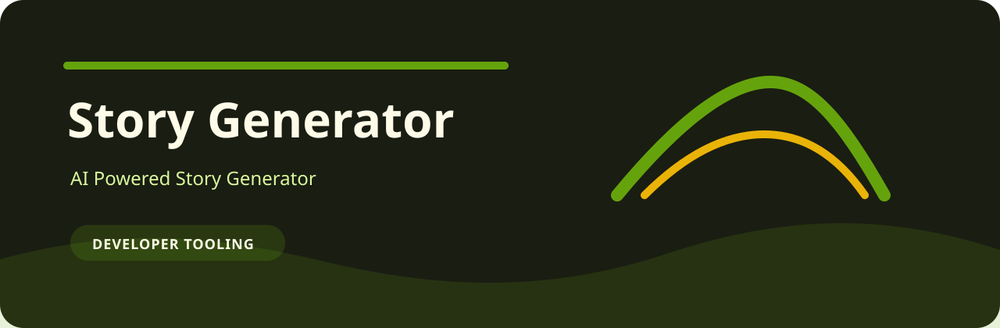
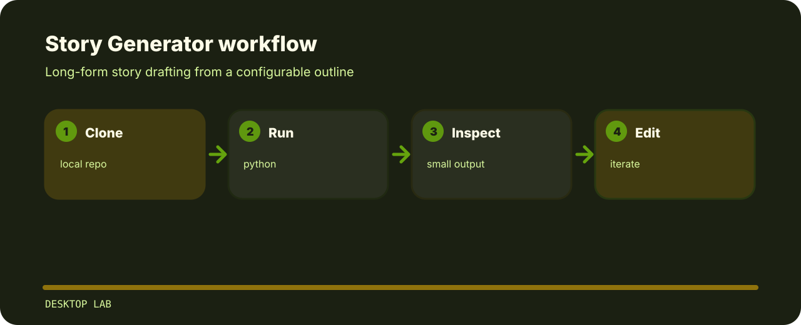

# Story Generator



Long-form story drafting from a configurable outline.

## How it moves



## First session

```bash
git clone https://github.com/mertefekurt/Story-Generator.git
cd Story-Generator
python -m venv .venv
source .venv/bin/activate
python -m pip install -r requirements.txt
cp theme.config theme.local.config
python story_generator.py --config theme.local.config
```

## Useful edges

- Designed as a focused desktop lab repo.
- Keeps setup short.
- Prioritizes readable output over infrastructure.

## Where to look

```text
.gitignore          project file
install_and_run.sh  project file
requirements.txt    runtime dependencies
story_generator.py  main generator
test_pdf.py         project file
```
