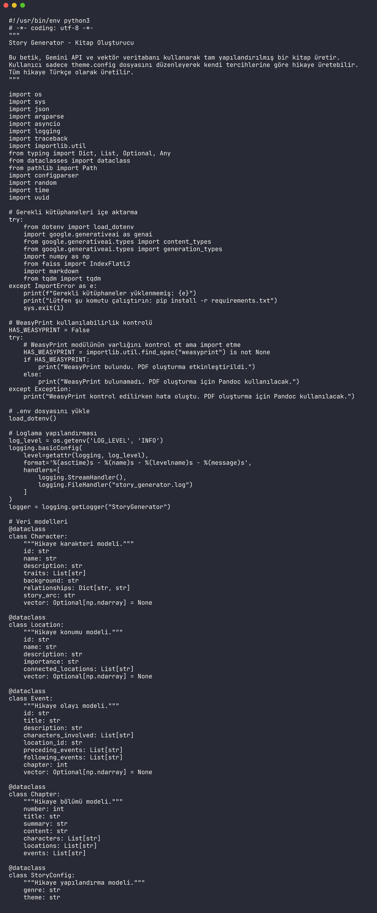

# Story Generator

<div align="center">


</div>

Story Generator creates structured long-form books from a configurable theme, plot, audience, tone, and chapter count. It uses Gemini for generation, vector memory for character/location/event continuity, and Markdown/PDF export paths for finished manuscripts.



## Features

- Theme-driven story generation from `theme.config`
- Character, location, event, and chapter data models
- Vector search support for continuity across long stories
- Progress logging and recovery-friendly output flow
- Markdown export for editing and publishing
- Optional PDF generation with WeasyPrint or Pandoc
- Installer script for guided setup

## Quick Start

```bash
git clone https://github.com/mertefekurt/Story-Generator.git
cd Story-Generator
python -m venv .venv
source .venv/bin/activate
pip install -r requirements.txt
cp theme.config theme.local.config
```

Add your Gemini API key to `.env`:

```bash
GEMINI_API_KEY=your_api_key_here
```

Run the generator:

```bash
python story_generator.py --config theme.local.config
```

## Configuration

| Setting | Purpose |
| --- | --- |
| `genre` | Story genre or category |
| `theme` | Central idea and emotional direction |
| `main_plot` | Primary conflict and narrative arc |
| `target_audience` | Reader age/style target |
| `chapter_count` | Number of chapters to generate |
| `language` | Output language for the manuscript |

## Project Structure

```text
story_generator.py   Main generator, data models, Gemini client, and vector memory
theme.config         Story configuration template
install_and_run.sh   Guided setup and launch script
test_pdf.py          PDF rendering check
requirements.txt     Runtime dependencies
```

## Notes

Long-form generation can be slow and API-costly depending on chapter count and token limits. Start with a small chapter count, review the output quality, then scale the manuscript.
